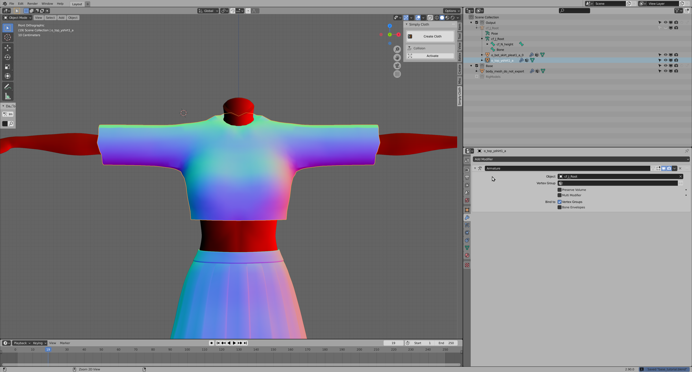
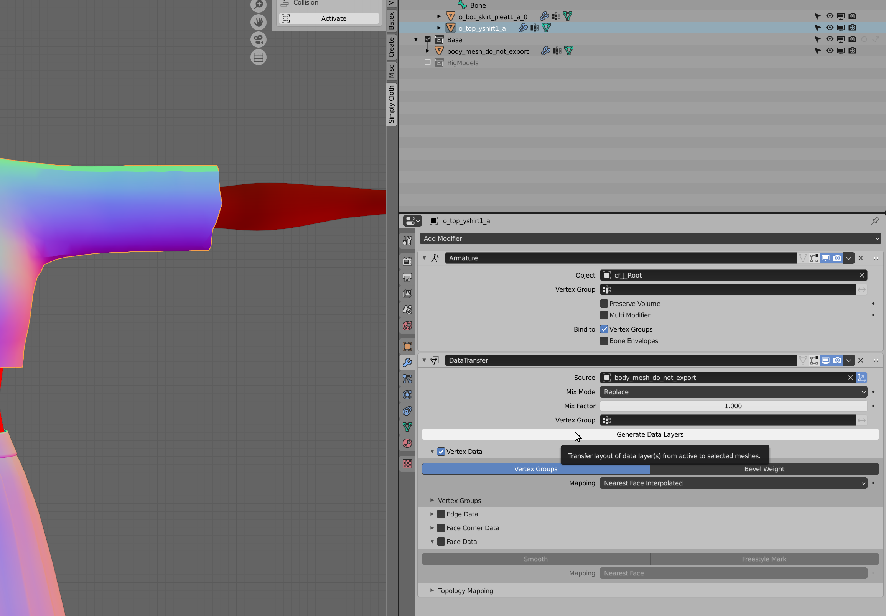
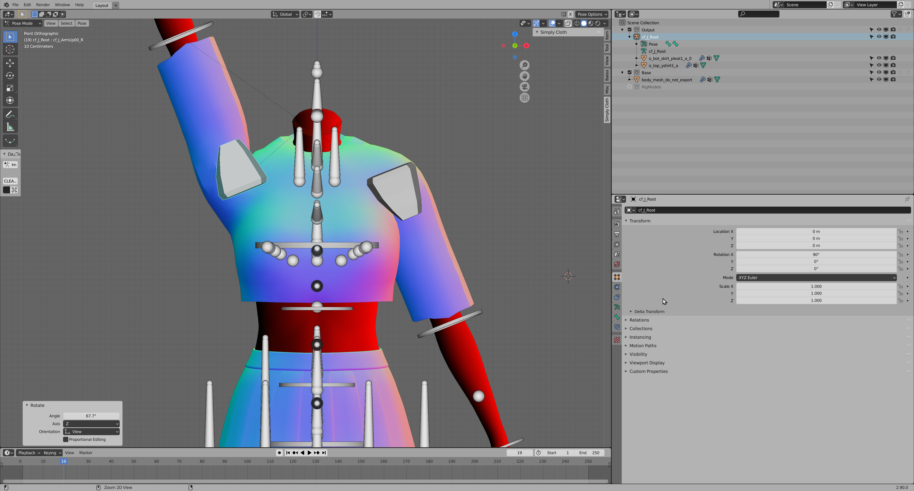
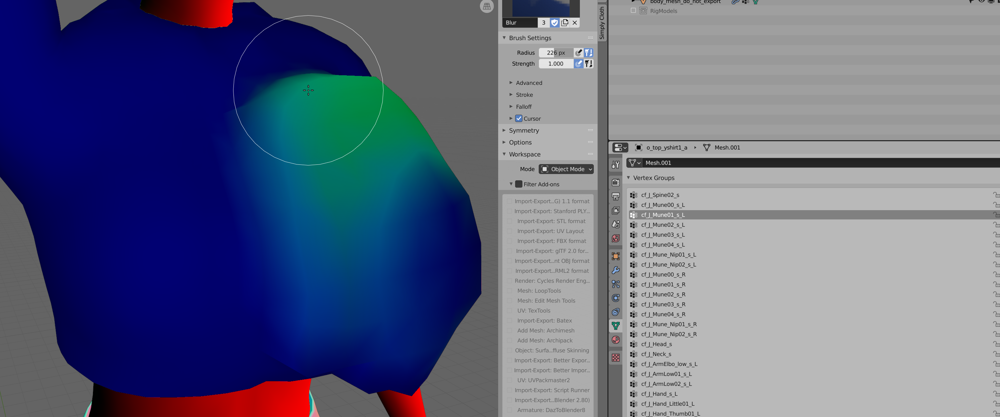
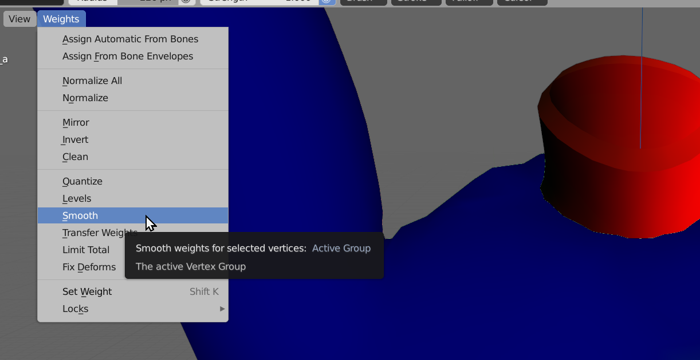
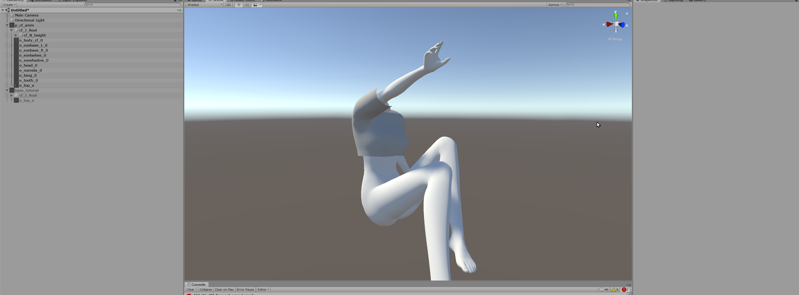
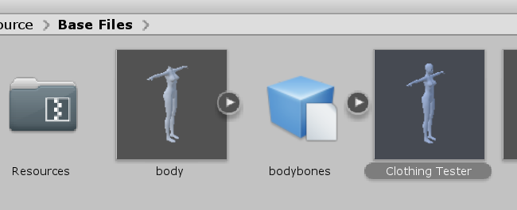
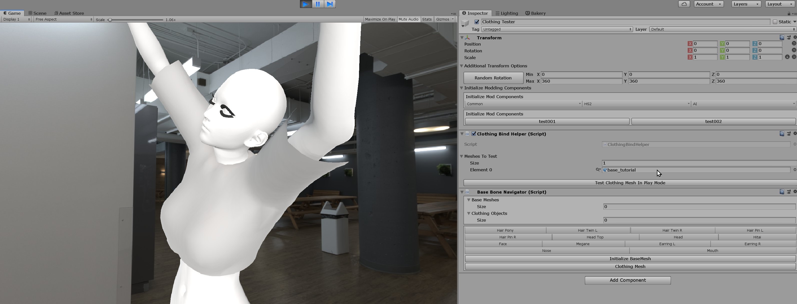

# Preparing Clothing Mesh

?> This tutorial only provides information about creating a mesh for the main game. Please check "Modding Tutorials" at the sidebar.

## Intro

This tutorial is for 3D Modeling Software called Blender. It is free, Open Source, and easy to learn (maybe).

Also, If you're using different 3D Modeling Software like Autodesk Maya or 3dsMax, I assume you already have a basic understanding of how 3d graphics working and how to make toothbrush.

## Process

### Load Basic Rig


First of all, you need to find the model's basic rig to make any clothing/outfit.

Locate the `base_female_clothing.blend` file and open it up with Blender.

The blender file already has most of the things you need to create the mesh for the character, so you don't have to look for other things.

### Make/Import Mesh



Once you opened the mesh file, import your mesh, or create the mesh with the base female mesh.

### Rig the mesh



After setting up your mesh around the base body, you need to rig your model.

You can hand paint the rig by the hand, but it's good to make a computer to the job first.

Add the `Data Transfer` modifier to the cloth mesh and set to target to `base body mesh` and check `vertex data` to project weight paints from the base body.

Click the `Generate Data Layer` to generate the vertex weights list and apply the modifier. Blender 2.8x has the Apply Button on the menu, but in Blender 2.9x, it's moved to inside of the "v" button.



After applying the modifier to the mesh, Select the bones and move the bones in `Pose Mode` and move around limbs to check if vertex weight has transferred correctly.

But, Do not trust data transfer entirely. Surely it does most of its job, but it's not perfect at all.


As you can see, the breast area has bad vertex weights. In that case, you need to fix it by yourself.

You can choose one of the options to fix this bad vertex weights:

1. paint and blur manually
   
   very painful but accurate
   but if you blur the edge with blur brush, it's less painful
2. blur all
   
   risky, not work mostly, but sometimes it works and saves you tons of hours

!> Unity Engine 2018.2.21f, 2018.4.11f only supports four weights per vertex. You need to use `Weights > Limit Total` and limit vertex weight counts to 4 to prevent data loss.

### Organize Mesh


Once you've done making your mesh, you need to organize your mesh to make it work in the game, and the modding tool automatically assigns the mesh and save you some time.

You must comply these rules to use your clothing mesh in the game.

-   Check you're exporting only one Armature.
-   Check if the armature name is `cf_J_Root`.
-   Check if the Armature's position, scale, the angle hasn't changed.
-   You need to make your meshes name complies the mesh naming convention.

    -   If you're making one of `Top`, `Bottom`, `Inner Top`, `Pantyhose`, `Inner Bottom`, `Set`, `Inner Set` clothing use this structure.

        ```
        cf_J_Root (Armature)
            ↳ n_bot_a (Required for bottom clothing)
                ↳ ... (optional, toggleable additional mesh for bottom clothing)
            ↳ n_bot_b (optional, mesh for half-off state for bottom clothing.)
                ↳ ... (optional, toggleable additional mesh for half-off bottom clothing)
            ↳ n_top_a (Required for top clothing)
                ↳ ... (optional, toggleable additional mesh for top clothing)
            ↳ n_top_b (optional, mesh for half-off state of top clothing.)
                ↳ ... (optional, toggleable additional mesh for half-off top clothing)
        ```

    -   If you're making anything else then rule is less stricter than above:

        ```
        cf_J_Root (Armature)
            ↳ * (Any mesh name is allowed.)
                ↳ ... (optional, toggleable additional mesh for bottom clothing)
        ```

-   Ensure the meshes under `cf_J_Root` Armature has `Armature Modifier`.

### Export Mesh


When you've done adjusting your mesh, you need to export your mesh to the unity editor to use the mesh in the game.

Since ILLUSION does not like default unity export, you need to do a few setups before exporting your model to the editor.

Use these export options to use your model in the Unity Engine.

-   **Bake Anim** → OFF
-   **Export Types** → {Empty, Armature, Mesh, Other}
-   **Scale** → 1
-   **Apply Scalings** → FBX ALL
-   **Forward** → -Z Forward
-   **Up** → Y Up
-   **Apply Unit** → ON
-   **Apply Transform** → ON
-   **Bake Animation** → OFF
-   If you know how to import/make your export preset in the Blender, then copy and paste this option.

```python
import bpy
op = bpy.context.active_operator

op.filepath = 'TARGET PATH NAME'
op.use_selection = True
op.use_active_collection = False
op.global_scale = 1.0
op.apply_unit_scale = True
op.apply_scale_options = 'FBX_SCALE_ALL'
op.bake_space_transform = True
op.object_types = {'MESH', 'ARMATURE', 'OTHER', 'EMPTY'}
op.use_mesh_modifiers = True
op.use_mesh_modifiers_render = True
op.mesh_smooth_type = 'OFF'
op.use_subsurf = False
op.use_mesh_edges = False
op.use_tspace = False
op.use_custom_props = False
op.add_leaf_bones = False
op.primary_bone_axis = 'Y'
op.secondary_bone_axis = 'X'
op.use_armature_deform_only = False
op.armature_nodetype = 'NULL'
op.bake_anim = False
op.bake_anim_use_all_bones = True
op.bake_anim_use_nla_strips = True
op.bake_anim_use_all_actions = True
op.bake_anim_force_startend_keying = True
op.bake_anim_step = 1.0
op.bake_anim_simplify_factor = 1.0
op.path_mode = 'AUTO'
op.embed_textures = False
op.batch_mode = 'OFF'
op.use_batch_own_dir = True
op.axis_forward = '-Z'
op.axis_up = 'Y'
```

### Preview your model in Unity Editor



Once you've made the model and imported it, you can test if your model works in the unity editor before putting it in the main game.

If the model is not working in the Unity Editor, it will not work in the main game either. So, checking the model is working in the engine is an important task you should not miss.

Remember that you're only testing if the mesh works correctly with the game's base body mesh.

Remember that you're only testing if the mesh works correctly with the game's base body mesh.



Locate `Clothing Tester` inside the `Base Files` folder and drag it to the scene to test your mesh.

After putting the prefab to the scene, click the `Clothing Tester` and find `Clothing Bind Helper` in the inspector and drag your clothing model to `Meshes To Test`.


If you can see your model inside of the `Meshes To Test` list, then you're good to go. Remember that you can put more than one model to test multiple combinations of models at once to see how they will work in the game.



When you go Play Mode and press "Test Clothing Mesh in Play Mode", you can see the meshes following the animation's character.

If the model is not following the bones, then you can check the Trouble Shooting section below.

## Trouble Shooting

!> If you can't find the issue here, then check [**Trouble Shooting**](tutorials/trouble-shooting.md) page.

### Mesh is not following the character

Check if you've correctly exported the model from the 3D Modeling Software.

Especially for blender users, include the Armature, mesh, and armature modifier to an exported FBX file, or it likely won't work.

If you failed to export the model once, the unity engine would think that your model is not the model with the bones.


In that case, you need to change the rig of the model to "Animation Type: Generic" to get your mesh working again.

### I can't see my Mesh / Mesh gets too big when I test it

Check if the model's scale is `1,1,1`. Otherwise, the Mode will re-scaled to the base model's scale.

### It works well in the Blender but not in the Unity Editor.

As I stated at the top of the document, only four weights per vertices are allowed by unity default. There is no way to lift this limitation, sorry.
