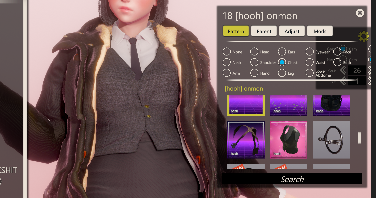
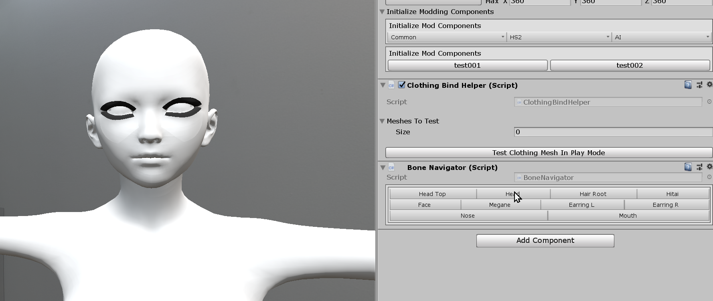
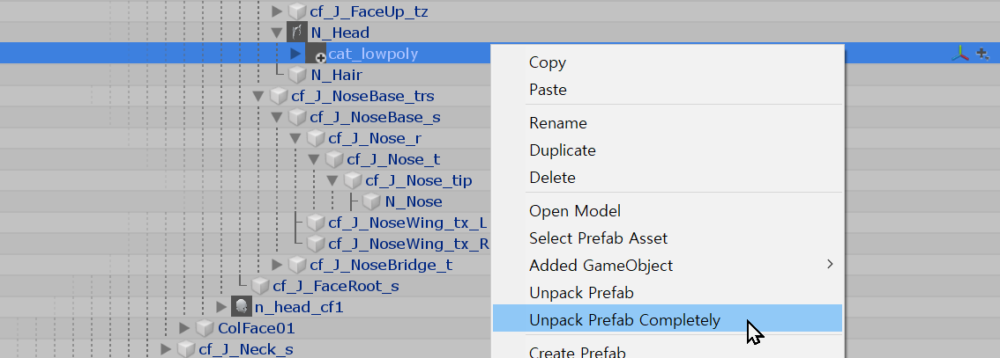
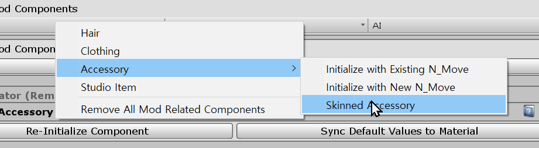
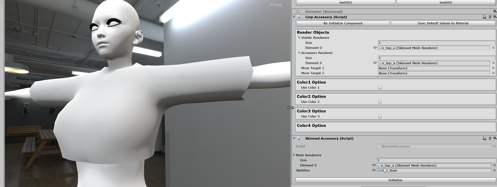
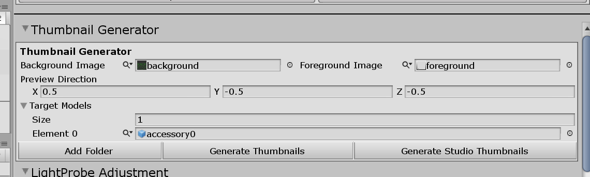
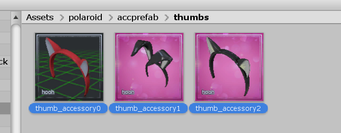

# Creating Custom Skinned Accessory

?> Skinned Accessory has a dependency on the `Hooah` plugin. You need to notify people to download `Hooah` to use your mod.

## What is Skinned Accessory?



Skinned Accessory is a plugin/mod that allows the modders to make clothing working in the accessory slot.

Skinned Accessory will allow people to add layers to their clothing or use another shader for the body's new overlay, such as a glowing tattoo.

## Related Documents

This page only contains how to put accessories into the game with adjustable attributes.

If you need more basic information like setup folders or preparing hair assets, please visit the pages below before continuing to read this Document:

-   [Getting Started with the hooh's Modding Tool](/getting_started.md)

-   [Setting up Folder](/tutorials/gearing-up.md)

-   [Character Top](/tutorials/chara-top.md)

## Steps

?> This tutorial only provides information about putting existing mesh to the main game. If you need a generic tutorial on creating a model, please check YouTube for basic tutorials.

### Setup Base



Initialize `Clothing Tester` from `Base Files`. After initiating the prefab to the scene, you'll see some inspector menu on the right side of the window.

### Place Model

You can place a model anywhere if you're making the skinned Accessory. Just make sure that your model is well-tested in the `Clothing Tester`. You can check more information at the bottom of [Character Top](/tutorials/chara-top.md) Document.

### Initializing the Component



You need to unpack the model prefab first to create a new accessory prefab.



When you've done putting your mesh to the scene, click it, navigate the right panel, and click the `Initialize Modding Components > Common > Accessory` button and select `Skinned Accessory`.

### Adjusting Option



Well, the Rest of the options are self-explanatory. Color 1,2,3 means enabling color adjustment 1,2,3 in the game.

Like the other mods, it requires special shaders to make it support more than two colors.

You can check information about color shaders in the [Shader Information](/technical/shaders.md) Document.

### Optional: Generating the Thumbnail



You can generate thumbnails for the accessories you've made quickly with the help of thumbnail generator.

You still can generate the thumbnail without the background or foreground, but I recommend having your format to distinguish your mod from other mods.

Unlike the studio thumbnail generator, the normal thumbnail generation will save its result to the `thumbs` folder of the folder where the project window is browsing.



The right amount of adjustment will generate fine thumbnails just enough to use for Character Maker UI.

!> Make sure that those images you've made are **"Read/Write Enabled"** or unity will refuse to utilize your foreground/background texture. Otherwise, the Unity Editor will refuse to read the texture.

### Creating Mod XML

```xml
<packer>
    <guid>example.accessory.text</guid> <!-- please change guid! -->
    <name>Example Accessory</name>
    <version>1.0.0</version>
    <author>My Name</author>
    <description>My first outfit mod</description>

    <!-- This section will contain bundle information -->
    <bundles>
        <folder auto-path="prefabs" from="prefabs" filter=".*\.prefab"/>
        <folder auto-path="thumbs" from="thumbs" filter=".*\.png"/>
    </bundles>

    <!-- This section will contain build information -->
    <build>
        <list type="acchead">
            <item kind="0" possess="1" name="My first accessory" mesh-a="accessory_asset_name" parent="N_Head" thumb="thumb_accessory_asset_name"/>
        </list>
    </build>
</packer>
```
You can set the category, and the accessory's default parent by changing the `parent` attribute in the `<item>` tag.

[xml common tip](../common/xml-common.md ':include')

### Building the Mod

[building the mod](../common/building-mod.md ':include')


[trouble shooting](../common/trouble-shooting.md ':include')
