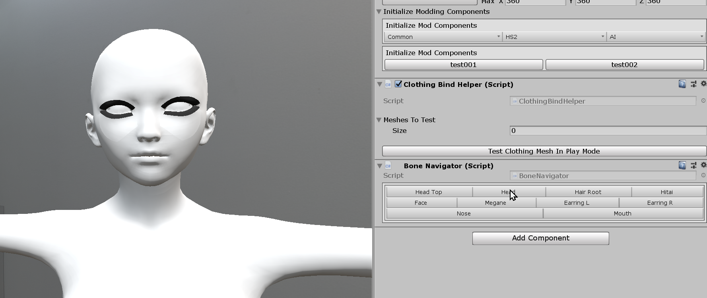
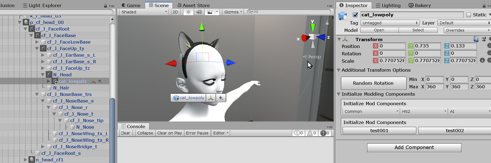
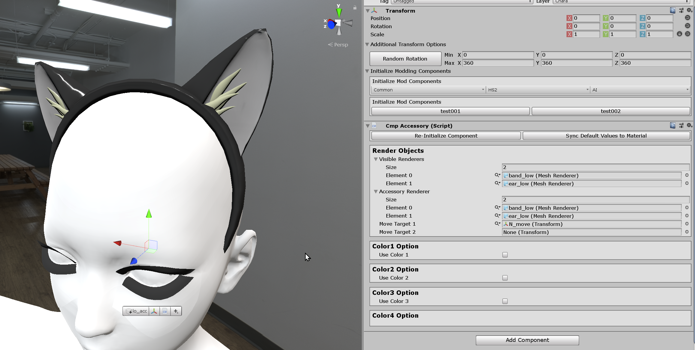
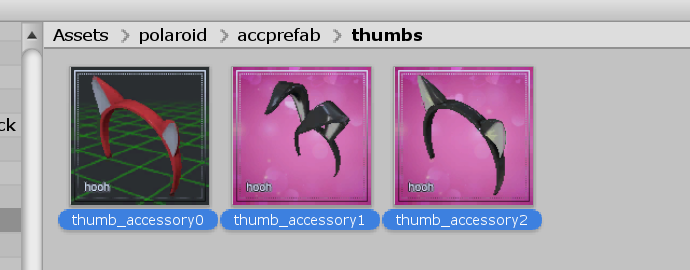

# Creating Custom Accessory

## Related Documents

This page only contains how to put accessories into the game with adjustable attributes.

If you need more basic information like setup folders or preparing hair assets, please visit the pages below before continuing to read this document:

-   [Getting Started with the hooh's Modding Tool](/getting_started.md)

-   [Setting up Folder](/tutorials/gearing-up.md)

-   [Studio Items](/tutorials/studio-item.md)

## Steps

?> This tutorial only provides information about putting existing mesh to the main game. If you need a generic tutorial on creating a model, please check YouTube for basic tutorials.

### Setup Base



Initialize `Clothing Tester` from `Base Files`. After initiating the prefab to the scene, you'll see some inspector menu on the right side of the window.

### Place Model


Click `N_Head` if you want to make a Head Accessory; there is plenty of options on the menu. Feel free to try other options.

After clicking the navigation button, put the model to `N_Head` (for this case).

### Initializing the Component


You need to unpack the model prefab first to create a new accessory prefab.


When you've done putting your mesh to the scene, click it, navigate the right panel, and click the `Initialize Modding Components > Common > Accessory` button.

`N_move` is a core object for adjusting the position of accessory in the character creator. You can set it up inside the Armature rig in the Blender or create it by yourself.

If you have `N_move` in your model, choose the first option. If it does not, choose the other option.

Then the Modding Tool will automatically find the references in your model and initialize everything to make your model work in the game.

### Adjusting Option



Well, the Rest of the options are self-explanatory. Color 1,2,3 means enabling color adjustment 1,2,3 in the game.

Like the other mods, it requires special shaders to make it support more than two colors.

You can check information about color shaders in the [Shader Information](/technical/shaders.md) Document.

### Optional: Generating the Thumbnail


You can generate thumbnails for the accessories you've made quickly with the help of thumbnail generator.

You still can generate the thumbnail without the background or foreground, but I recommend having your format to distinguish your mod from other mods.

Unlike the studio thumbnail generator, the normal thumbnail generation will save its result to the `thumbs` folder of the folder where the project window is browsing.



The right amount of adjustment will generate fine thumbnails just enough to use for Character Maker UI.

!> Make sure that those images you've made are **"Read/Write Enabled"** or unity will refuse to utilize your foreground/background texture. Otherwise, the Unity Editor will refuse to read the texture.

### Creating Mod XML

```xml
<packer>
    <guid>example.accessory.text</guid> <!-- please change guid! -->
    <name>Example Accessory</name>
    <version>1.0.0</version>
    <author>My Name</author>
    <description>My first outfit mod</description>

    <!-- This section will contain bundle information -->
    <bundles>
        <folder auto-path="prefabs" from="prefabs" filter=".*\.prefab"/>
        <folder auto-path="thumbs" from="thumbs" filter=".*\.png"/>
    </bundles>

    <!-- This section will contain build information -->
    <build>
        <list type="acchead">
            <item kind="0" possess="1" name="My first accessory" mesh-a="accessory_asset_name" parent="N_Head" thumb="thumb_accessory_asset_name"/>
        </list>
    </build>
</packer>
```

You can set the category, and the accessory's default parent by changing the `parent` attribute in the `<item>` tag.

All the tag's possible values are in the [XML List Types](/technical/category-list.md) Document.

!> The GUID, bundle name, build name should be **unique**, and you can only refer files in Asset Bundles in the Mod XML File.

You can check the comment inside the XML Code section above to see what to do.

For more detailed information, you can check those documents for reference.

-   [XML File Structure](/technical/xml-file.md) for general Mod File Information
-   [Auto-Path Lists](/technical/autopath-list.md) for `<folder auto-path>`
-   [XML List Types](/technical/category-list.md) for `<list type>` and `<item>`

### Build Mod


Drag and drop your custom mod XML file into the mod builder's target window.

After setting the build target, check if the output path is where you desire to put your custom zipmod archive.

If everything is okay, validate your XML file if you didn't make any mistake inside the XML file.

Unless a mod packer cannot find an asset or has some issue while resolving the Asset Bundle's path, it says nothing.

Then you're good to go. Press the big green button and to build the mod.

### Trouble Shooting

!> If you can't find the issue here, then check [**Trouble Shooting**](/tutorials/trouble-shooting.md) page.
