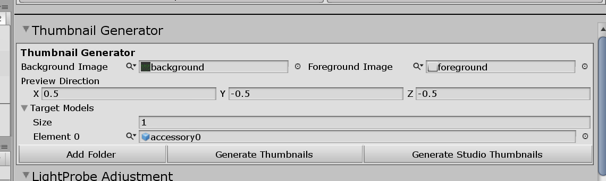

# Creating Custom Gloves/Shoes

[kind-introduction](../common/tutorial-introduction.md ':include')

-   [Getting Started with the hooh's Modding Tool](/getting_started.md)
-   [Setting up Folder](/tutorials/gearing-up.md)

## Additional Notes for Preparing the Asset

For gloves and shoes, If you're the Blender user, I recommend using the `Mirror` and `Lattice` Modifier for creating gloves and shoes.

The `Lattice Modifier` will allow you to modify and deform whole meshes without destroying the model's original shape and topology. It will save a lot of time to make the mesh fit the base body mesh. The same rule applies top and bottom outfit meshes.

The `Mirror Modifier` will allow you to copy the mesh and mirror the vertex groups while keeping both gloves and shoe's information the same.

## Steps

[setup-char](../common/setup-char-mesh.md ':include')


[setup-char](../common/setup-clothing-component.md ':include')

### Setting Colormask

AI/HS2 utilizes custom colormask texture to color the clothing's texture with various colors.

If you don't want to struggle with setting up colormask, you can draw a black dot and save it as png and call it colormask.

You can check [**ILLUSION Shader**](/technical/illusion-shader.md) document for more detailed information about colormask

### Register Prefab

Drag your GameObjects to the Project folder. Put your clothing model in the `prefabs` folder in your modding directory.

If you have more than one clothing, I recommend you to create folders like this:

```
outfit01
outfit02
```

The Modding Tool can distinguish the same name assets with a hint, But you must avoid setting all meshes and texture to the same name.

### Optional: Generating the Thumbnail



You can generate thumbnails for the accessories you've made quickly with the help of thumbnail generator.

You still can generate the thumbnail without the background or foreground, but I recommend having your format to distinguish your mod from other mods.

Unlike the studio thumbnail generator, the normal thumbnail generation will save its result to the `thumbs` folder of the folder where the project window is browsing.

### Creating Mod XML

```xml
<packer>
    <guid>example.gloveshoes.test</guid> <!-- please change guid! -->
    <name>Example Clothing Glove/Shoes</name>
    <version>1.0.0</version>
    <author>My Name</author>
    <description>My first outfit mod</description>
    <bundles>
        <folder auto-path="prefabs" from="gloves00" filter=".*?\.(psd|png|tif|prefab)"/>
        <folder auto-path="prefabs" from="shoes00" filter=".*?\.(psd|png|tif|prefab)"/>
        <folder auto-path="thumbs" from="thumbs" filter=".*?\.(psd|png|tif)"/>
    </bundles>
    <build>
		<list type="fgloves">
			<item
				kind="0" possess="1" name="My First Glove"
                mesh-a="my_gloves_prefab_name" state="1" tex-main="diffuse"
                tex-mask="colormask" tex-main2="0" tex-mask2="0" thumb="thumb_my_gloves_prefab_name"
			/>
		</list>
		<list type="fshoes">
			<item
				kind="0" possess="1" name="My First Shoes"
                mesh-a="my_shoes_prefab_name" state="1" tex-main="diffuse"
                tex-mask="colormask" tex-main2="0" tex-mask2="0" thumb="thumb_my_shoes_prefab_name"
			/>
		</list>
    </build>
</packer>
```

[xml common tip](../common/xml-common.md ':include')

### Building the Mod

[building the mod](../common/building-mod.md ':include')


### Test In-Game

Test your clothes working in-game.

I recommend 2155x's makersearch to save your time


[troubleshooting](../common/trouble-shooting.md ':include')
