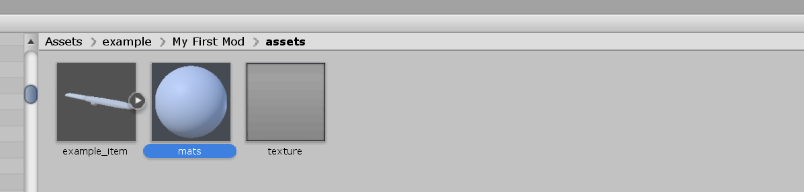
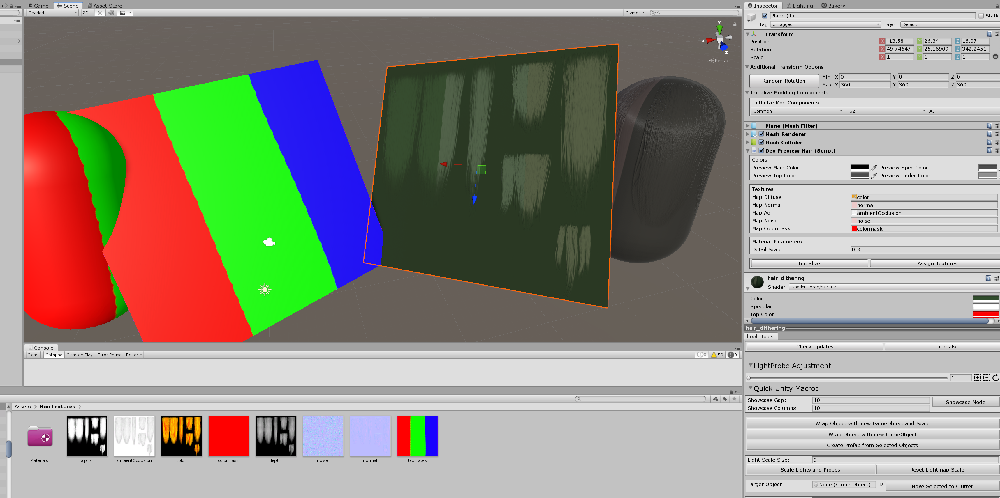

# Creating Custom Hairs

## Related Documents

This page only contains how to put hair models into the game with adjustable attributes.

If you need more basic information like setup folders or preparing hair assets, please visit the pages below before continuing to read this document:

-   [Getting Started with the hooh's Modding Tool](/getting_started.md)
-   [Setting up Folder](/tutorials/gearing-up.md)
-   [Preparing Hair Assets](/prepping/hair-mesh.md)

## Steps

### Putting Assets

!> `.OBJ` format does not support FK studio items. Make sure that you're importing `.FBX` format 3D Mesh Files to make FK works on the model.



Import or make the 3D asset and drag and drop into `assets` folder in your mod folder

It would be best to import all textures, models, and all other required assets to the Unity Editor.



1. Select any game object to apply hair material.
2. Add Component "DevPreviewHair"
3. Go to folder where you stored your hair textures.
4. Press Assign Textures or Drag and Drop textures manually to Textures Area.
   Assign Textures will seek for:
    - Any Texture that contains word "color" in the name but does not have "mask" in the name.
    - Any Texture that has "normal" in the name.
    - Any Texture that has "ao", "ambient", "occlusion" in the name.
    - Any Texture that has "noise" in the name.
    - Any Texture that has "colormask" in the name.
5. Check if material has all textures.
6. Press Initialize

### Setup Mod XML File

```xml
<packer>
	...
    <bundles>
    	<!-- referencing "tattoo" folder. path is relative to the folder  where mod.xml is present -->
        <folder from="tattoo" auto-path="textures" filter=".+\.(png|tga|tif|psd)"/>
	</bundles>
	<build name="example_bodypaint">
		<list type="spaint">
			<item kind="" possess="" name="My Custom Tattoo" tex-a="TextureName" tex-g="TextureName2" thumb="ThumbnailName"/>
		</list>
	</build>
</packer>
```

[xml common tip](../common/xml-common.md ':include')

### Building the Mod

[building the mod](../common/building-mod.md ':include')

## Caution

1. You can't include AssetBundle-loaded materials into AssetBundle BuildList.
2. All preview is temporary to the session. Restarting unity might break the texture.


[trouble shooting](../common/trouble-shooting.md ':include')
