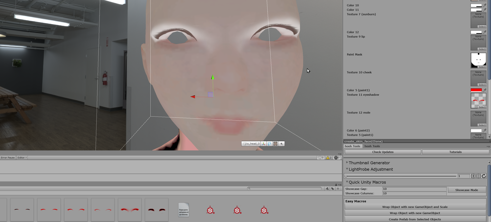

# Creating Custom Eyeshadows

[kind-introduction](../common/tutorial-introduction.md ':include')

-   [Getting Started with the hooh's Modding Tool](getting_started.md)
-   [Setting up Folder](tutorials/gearing-up.md)

## Steps

### Creating Textures

Making Eyeshadow is a bit tricky. You can start making eyeshadow faster by using one of template available in the project.

You can find all kind of examples in the modding tool's `Examples` Folder.

### Importing Texture

Save the Textures you've made to your custom Mod Folder. You can see how to set up the folder in the [Setting up Folder](tutorials/gearing-up.md) Document.

In this case, I'm going to save all of my textures into the `textures` folder.

When you click the texture file, the inspector will change to "Import Option".

Change a few options in the inspector menu.

-   **Alpha Source** → Input Texture Alpha
-   **Alpha is Transparency** → NO
-   **Streaming Mip Map** → NO
-   **Generate Mip Maps** → NO
-   **Wrap Mode** → Clamp

!> I recommend not to touch any compression options if you don't know what you're doing. Some compression option will make the Texture lose its transparency! You can check [the Unity Engine's Document about texture compression](https://docs.unity3d.com/Manual/class-TextureImporterOverride.html) to see what's going on.

### Testing Texture



Go to the `Base Files` folder and put `Generator Tester` prefab to the scene. Unfortunately there is no nice UI yet, you need to click the mesh and change the parameter.

### Creating Mod XML File

```xml
<packer>
    <guid>example.custom.eyeshadow</guid>
    <name>Custom Eyeshadow</name>
    <version>1.0.0</version>
    <author>Your Name</author>
    <description>My First Eyeshadow Pack</description>
    <bundles>
        <!-- referencing "textures" folder. path is relative to the folder where mod.xml is present -->
        <each from="textures" auto-path="textures" filter=".+\.(png|tga|tif|psd)"/>
        <folder from="thumbs" auto-path="thumbs" filter=".+\.(png|tga|tif|psd)"/>
    </bundles>
    <build>
        <!-- Custom Eyeshadow are for all genders. -->
        <list type="seyeshadow">
            <item name="My Custom Eyeshadow" tex-a="my_texture_name"  tex-g="my_texture_name" thumb="my_thumbnail_name"/>
        </list>
    </build>
</packer>
```

In this case, Each custom eyeshadow only requires one file per an item in the list. I will use the `<each>` bundle operator to create each fil as an asset bundle.

[xml common tip](../common/xml-common.md ':include')

### Building the Mod

[building the mod](../common/building-mod.md ':include')

[troubleshooting](../common/trouble-shooting.md ':include')

### Uh.. My Tattoo is repeating all over the skin/face!

The Texture's import option is wrong. All the tattoo, chests, and other paint parts must be in `Clamp` Wrap Mode.

You can set the **Wrap Mode** by clicking your Texture and search around the middle of the menu.
