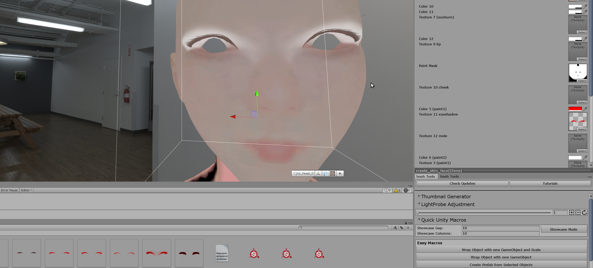

# Creating Custom Face/Body Paints

## Related Documents

This page only contains how to put hair models into the game with adjustable attributes.

If you need more basic information like setup folders or preparing hair assets, please visit the pages below before continuing to read this document:

-   [Getting Started with the hooh's Modding Tool](getting_started.md)
-   [Setting up Folder](tutorials/gearing-up.md)

## Steps

### Creating Textrure

Skinpaint is pretty simple. All you need to make is transparent rectengular icon.

You can find all knid of examples in the modding tool's `Examples` Folder.

### Importing Texture

Save the Textures you've made to your custom Mod Folder. You can see how to set up the folder in the [Setting up Folder](tutorials/gearing-up.md) Document.

In this case, I'm going to save all of my textures into the `textures` folder.

When you click the texture file, the inspector will change to "Import Option".

Change a few options in the inspector menu.

-   **Alpha Source** → Input Texture Alpha
-   **Alpha is Transparency** → NO
-   **Streaming Mip Map** → NO
-   **Generate Mip Maps** → NO
-   **Wrap Mode** → Clamp

!> I recommend not to touch any compression options if you don't know what you're doing. Some compression option will make the Texture lose its transparency! You can check [the Unity Engine's Document about texture compression](https://docs.unity3d.com/Manual/class-TextureImporterOverride.html) to see what's going on.

### Testing Texture



Go to the `Base Files` folder and put `Generator Tester` prefab to the scene. Unfortunately there is no nice UI yet, you need to click the mesh and change the parameter.

### Creating Mod XML File

```xml
<packer>
    <guid>example.custom.skinpaint</guid>
    <name>Custom Skinpaint</name>
    <version>1.0.0</version>
    <author>Your Name</author>
    <description>My First Skinpaint Pack</description>
    <bundles>
    	<!-- referencing "skinpaint" folder. path is relative to the folder  where mod.xml is present -->
        <folder from="skinpaint" auto-path="textures" filter=".+\.(png|tga|tif|psd)"/>
        <folder from="thumbs" auto-path="thumbs" filter=".+\.(png|tga|tif|psd)"/>
	</bundles>
	<build>
		<list type="spaint">
			<item name="My Custom skinpaint" tex-a="TextureName" tex-g="TextureName2" thumb="ThumbnailName"/>
		</list>
	</build>
</packer>
```

In this case, Each custom eyeshadow only requires one file per an item in the list. I will use the `<each>` bundle operator to create each fil as an asset bundle.

[xml common tip](../common/xml-common.md ':include')

### Building the Mod

[building the mod](../common/building-mod.md ':include')

[trouble shooting](../common/trouble-shooting.md ':include')

### Uh.. My Skinpaint is repeating all over the skin/face!

The Texture's import option is wrong. All of the skinpaint, chests, and other paint parts must be in `Clamp` Wrap Mode.

You can set the **Wrap Mode** by clicking your Texture and search around the middle of the menu.
