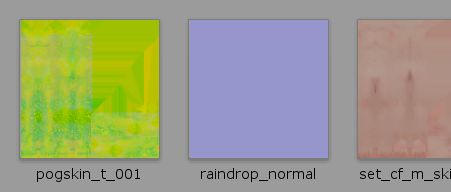
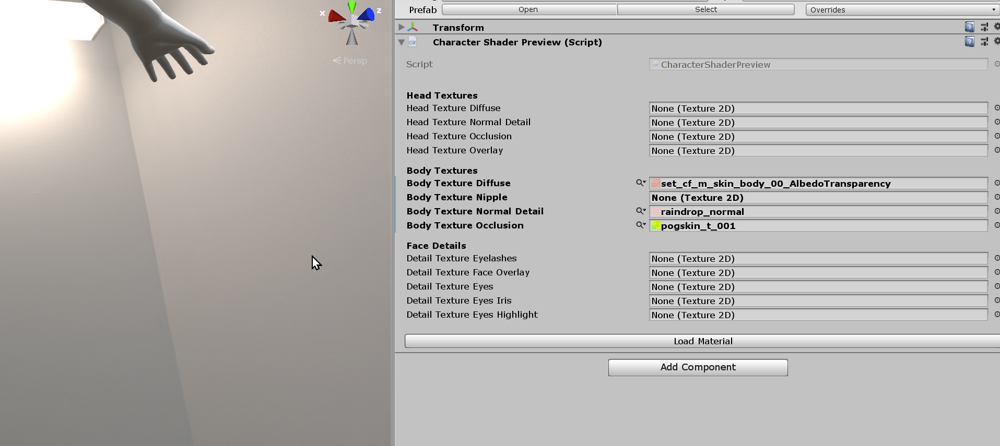

# Creating Custom Skins

[kind-introduction](../common/tutorial-introduction.md ':include')

-   [Getting Started with the hooh's Modding Tool](getting_started.md)
-   [Setting up Folder](tutorials/gearing-up.md)

## Steps

### Creating Textures



ILLUSION's shaders are using custom textures for the face textures. So, You need to know each color channel of the texture purpose to create custom skins.

-   Diffuse Texture
-   Normal Texture
-   Occlusion Texture
    | Channel | Purpose |
    | -- | ------ |
    | Red | Glossiness |
    | Green | Occlusion |
    | Blue | Translucency |

Don't forget to set your image to 16-bit Color Depth. Otherwise, you're going to get a lot of artifacts to your custom Texture.

### Importing Texture


Save the Textures you've made to your custom Mod Folder. You can see how to set up the folder in the [Setting up Folder](tutorials/gearing-up.md) Document.

In this case, I'm going to save all of my textures into the `textures` folder.

When you click the texture file, the inspector will change to "Import Option".

Change a few options in the inspector menu.

-   **Wrap Mode** → Clamp

!> I recommend not to touch any compression options if you don't know what you're doing. Some compression option will make the Texture lose its transparency! You can check [the Unity Engine's Document about texture compression](https://docs.unity3d.com/Manual/class-TextureImporterOverride.html) to see what's going on.

### Testing Texture



Go to the `Base Files` folder and put `Texture Tester` prefab to the scene.

Assign Textures that you want to test in the component. You can assign textures by simple drag and drop the texture to the slot.

### Creating Mod XML File

```xml
<packer>
    <guid>example.custom.skins</guid>
    <name>Custom skins</name>
    <version>1.0.0</version>
    <author>Your Name</author>
    <description>My First skins Pack</description>
    <bundles>
        <!-- referencing "textures" folder. path is relative to the folder where mod.xml is present -->
        <folder from="textures" auto-path="detail00" filter=".+\.(png|tga|tif|psd)"/>
        <folder from="textures" auto-path="detail01" filter=".+\.(png|tga|tif|psd)"/>
        <folder from="textures" auto-path="diffuse00" filter=".+\.(png|tga|tif|psd)"/>
        <folder from="textures" auto-path="diffuse01" filter=".+\.(png|tga|tif|psd)"/>
        <folder from="thumbs" auto-path="thumbs" filter=".+\.(png|tga|tif|psd)"/>
    </bundles>

    <build>
		<list type="fdetailb">
			<item kind="0" possess="1" name="My First Detail Skin" tex-a="OcclusionTexture" tex-n="NormalTexture" thumb="ThumbnailTexture1"/>
			<item kind="0" possess="1" name="My First Detail Skin" tex-a="OcclusionTexture2" tex-n="NormalTexture2" thumb="ThumbnailTexture1"/>
		</list>
		<list type="fskinb">
			<item kind="0" possess="1" name="My First Skin" tex-a="DiffuseTexture" thumb="ThumbnailTexture2"/>
			<item kind="0" possess="1" name="My First Skin" tex-a="DiffuseTexture2" thumb="ThumbnailTexture2"/>
		</list>
    </build>
</packer>
```
[xml common tip](../common/xml-common.md ':include')

### Building the Mod

[building the mod](../common/building-mod.md ':include')

[troubleshooting](../common/trouble-shooting.md ':include')

### My Tattoo is repeating all over the skincare

The Texture's import option is wrong. All the tattoo, chests, and other paint parts must be in `Clamp` Wrap Mode.

You can set the **Wrap Mode** by clicking your Texture and search around the middle of the menu.
