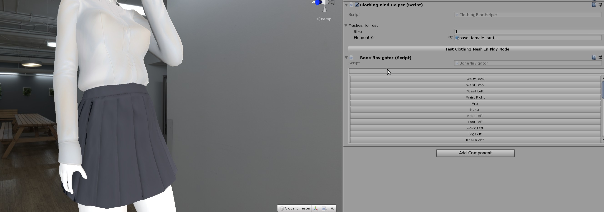
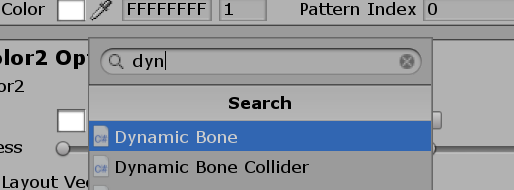
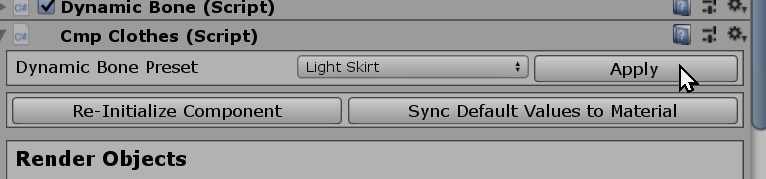

# Creating Custom Top

[kind-introduction](../common/tutorial-introduction.md ':include')

-   [Getting Started with the hooh's Modding Tool](getting_started.md)
-   [Setting up Folder](tutorials/gearing-up.md)
-   [Creating Clothing Mesh](prepping/clothing-mesh.md)

## Steps

?> This tutorial only provides information about putting existing mesh to the main game. Please check [Creating Clothing Mesh](prepping/clothing-mesh.md) Document if you want to know how to make a clothing model.

[setup-char](../common/setup-char-mesh.md ':include')



[setup-char](../common/setup-clothing-component.md ':include')

### Setting Colormask

AI/HS2 utilizes custom colormask texture to color the clothing's texture with various colors.

If you don't want to struggle with setting up colormask, you can draw a black dot and save it as png and call it colormask.

You can check [**ILLUSION Shader**](technical/illusion-shader.md?id=texturepattern-rendering-clothing) document for more detailed information about colormask

### Setting Up Dynamic Bones

!> Dynamic Bone is a paid asset. The only reason it's in the modding tool is to make users create dynamic clothing for the game. Do not use this asset to other projects.

You can manually set up by yourself or use dynamic bone preset.

#### Manual



Find and add dynamic bone presets

#### Automatic Preset



Select the preset and press apply button

### Check Dynamic Bones

You need to check dynamic bones are working correctly in the play mode. If everything is working, the skirt will move when you move around the skirt in the play mode.

### Register Prefab

Drag your GameObjects to the Project folder. Put your clothing model in the `prefabs` folder in your modding directory.

If you have more than one clothing, I recommend you to create folders like this:

```
outfit01
outfit02
```

The Modding Tool can distinguish the same name assets with a hint, But you must avoid setting all meshes and texture to the same name.

### Optional: Generating the Thumbnail


You can generate thumbnails for the accessories you've made quickly with the help of thumbnail generator.

You still can generate the thumbnail without the background or foreground, but I recommend having your format to distinguish your mod from other mods.

Unlike the studio thumbnail generator, the normal thumbnail generation will save its result to the `thumbs` folder of the folder where the project window is browsing.

### Creating Mod XML

```xml
<packer>
    <guid>example.clothing.text</guid> <!-- please change guid! -->
    <name>Example Clothing</name>
    <version>1.0.0</version>
    <author>My Name</author>
    <description>My first outfit mod</description>
    <bundles>
        <folder auto-path="prefabs" from="bot00" filter=".*?\.(psd|png|tif|prefab)"/>
        <folder auto-path="prefabs" from="innerbot00" filter=".*?\.(psd|png|tif|prefab)"/>
        <folder auto-path="thumbs" from="thumbs" filter=".*?\.(psd|png|tif)"/>
    </bundles>
    <build>
        <!-- If you put your clothing inside of regular bottom category, use example below-->
        <list type="fbottom">
            <item
				kind="0" possess="1" name="My First Bottom Clothing" en_us="0" state="0" coordinate="0"
                mesh-a="bottom_clothing_prefab" no-bra="0" bodymask-bundle="0" bodymask-tex="0" bramask-bundle="0" bramask-tex="0"
				breakmask-tex="0" innermask-tb-bundle="0" innermask-tb-tex="0" innermask-b-bundle="0" innermask-b-tex="0"
				panstmask-bundle="0" panstmask-tex="0" bodymask-b-bundle="0" bodymask-b-tex="0"
				tex-main="clothing_diffuse_texture" tex-mask="clothing_colormask_texture" tex-main2="0" tex-mask2="0" tex-main3="0" tex-mask3="0" hide-bottom="0"
				thumb="thumb_bottom_clothing_prefab"
            />
        </list>
        <!-- If you put your clothing inside of inner bottom category, use example below-->
		<list type="finbottom">
            <!-- if you set coordinate to "1", it becomes top/bottom set. -->
			<item
    			kind="0" possess="1" name="My First Inner Bottom" mesh-a="inner_bottom_clothing_prefab" state="1"
            	tex-main="inner_clothing_diffuse_texture" tex-mask="inner_clothing_colormask_texture"
                tex-main2="0" tex-mask2="0" hide-bottom="0" thumb="inner_clothing_colormask_texture"
			/>
		</list>
        <!-- If you put your clothing inside of pantyhose category, use example below-->
		<list type="fpanst">
            <!-- if you set coordinate to "1", it becomes top/bottom set. -->
			<item
    			kind="0" possess="1" name="My First pantyhose Bottom" mesh-a="pantyhose_bottom_clothing_prefab" state="1"
            	tex-main="pantyhose_clothing_diffuse_texture" tex-mask="pantyhose_clothing_colormask_texture"
                tex-main2="0" tex-mask2="0" hide-bottom="0" thumb="pantyhose_clothing_colormask_texture"
			/>
		</list>
    </build>
</packer>
```
[xml common tip](../common/xml-common.md ':include')

### Building the Mod

[building the mod](../common/building-mod.md ':include')


[troubleshooting](../common/trouble-shooting.md ':include')
