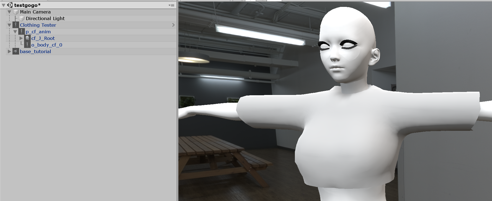

# Creating Custom Top

[kind-introduction](../common/tutorial-introduction.md ':include')

-   [Getting Started with the hooh's Modding Tool](getting_started.md)
-   [Setting up Folder](tutorials/gearing-up.md)
-   [Creating Clothing Mesh](prepping/clothing-mesh.md)

## Steps

?> This tutorial only provides information about putting existing mesh to the main game. Please check [Creating Clothing Mesh](prepping/clothing-mesh.md) Document if you want to know how to make a clothing model.

[setup-char](../common/setup-char-mesh.md ':include')



[setup-char](../common/setup-clothing-component.md ':include')

### Setting Colormask

AI/HS2 utilizes custom colormask texture to color the clothing's texture with various colors.

If you don't want to struggle with setting up colormask, you can draw a black dot and save it as png and call it colormask.

You can check [**ILLUSION Shader**](technical/illusion-shader.md?id=texturepattern-rendering-clothing) document for more detailed information about colormask

### Register Prefab

Drag your GameObjects to the Project folder. Put your clothing model in the `prefabs` folder in your modding directory.

If you have more than one clothing, I recommend you to create folders like this:

```
outfit01
outfit02
```

The Modding Tool can distinguish the same name assets with a hint, But you must avoid setting all meshes and texture to the same name.

### Optional: Generating the Thumbnail


You can generate thumbnails for the accessories you've made quickly with the help of thumbnail generator.

You still can generate the thumbnail without the background or foreground, but I recommend having your format to distinguish your mod from other mods.

Unlike the studio thumbnail generator, the normal thumbnail generation will save its result to the `thumbs` folder of the folder where the project window is browsing.

### Creating Mod XML

```xml
<packer>
    <guid>example.clothing.text</guid> <!-- please change guid! -->
    <name>Example Clothing</name>
    <version>1.0.0</version>
    <author>My Name</author>
    <description>My first outfit mod</description>
    <bundles>
        <folder auto-path="prefabs" from="top00" filter=".*?\.(psd|png|tif|prefab)"/>
        <folder auto-path="prefabs" from="innertop00" filter=".*?\.(psd|png|tif|prefab)"/>
        <folder auto-path="thumbs" from="thumbs" filter=".*?\.(psd|png|tif)"/>
    </bundles>
    <build>
        <!-- If you put your clothing inside of regular top category, use example below-->
        <list type="ftop">
            <item
                    kind="0" possess="1" name="My First Outfit" state="0"
                    coordinate="1" mesh-a="MyPrefab" en-us="0"
                    no-bra="0" bodymask-bundle="0" bodymask-tex="0"
                     bramask-bundle="0" bramask-tex="0" breakmask-tex="0"
                    innermask-tb-bundle="0" innermask-tb-tex="0"
                    innermask-b-bundle="0" innermask-b-tex="0"
                    panstmask-bundle="0" panstmask-tex="0"
                     bodymask-b-bundle="0" bodymask-b-tex="0"
                    tex-main="MainTextureForMyOutfit"
                     tex-mask="ColorMaskTextureForMyOutfit" tex-main2="0" tex-mask2="0"
                    tex-main3="0" tex-mask3="0" hide-bottom="0" thumb="Thumbnail"
            />
        </list>
        <!-- If you put your clothing inside of inner top category, use example below-->
		<list type="fintop">
            <!-- if you set coordinate to "1", it becomes top/bottom set. -->
			<item
				kind="0" possess="2" name="[hooh] My Prefab" mesh-a="MyPrefab" state="0"
				coordinate="0" overbra-type="0" bodymask-tex="0"
				tex-main="MainTextureForMyOutfit" tex-mask="ColorMaskTextureForMyOutfit"
				hide-bottom="0" thumb="Thumbnail"
			/>
		</list>
    </build>
</packer>
```
[xml common tip](../common/xml-common.md ':include')

### Building the Mod

[building the mod](../common/building-mod.md ':include')

[troubleshooting](../common/trouble-shooting.md ':include')
