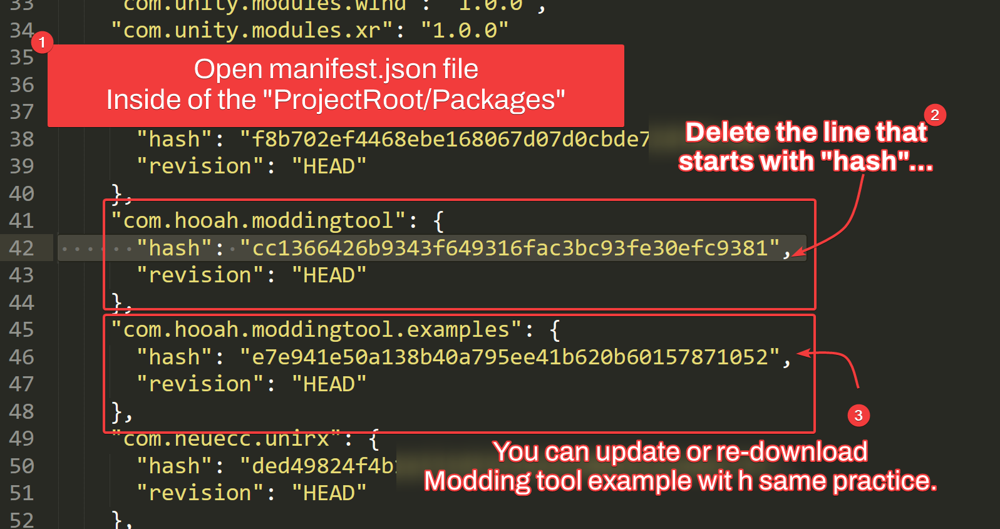

# Updating the Modding Tool

## Summary

It is important to keep the modding tool to the latest version to reduce your works and ensuring the quality of your mods.

Prior to 0.7.0, Updating the modding tool required re-installation of the whole project for some small piece of the code.

From now, If you're updated your modding tool to 0.7.0+, You can update the Modding Tool Module and the Examples separately.

## Step-by-Step Guide

1. Open `ProjectRoot/Packages/manifest.json` file.
2. Navigate to the `com.hooah.moddingtool` section and remove the line that starts with "hash".
3. If you want to update the Modding Tool Example, Go to `com.hooah.moddingtool.example` then remove the line that stats with "hash".

[trouble shooting](../common/trouble-shooting.md ':include')
