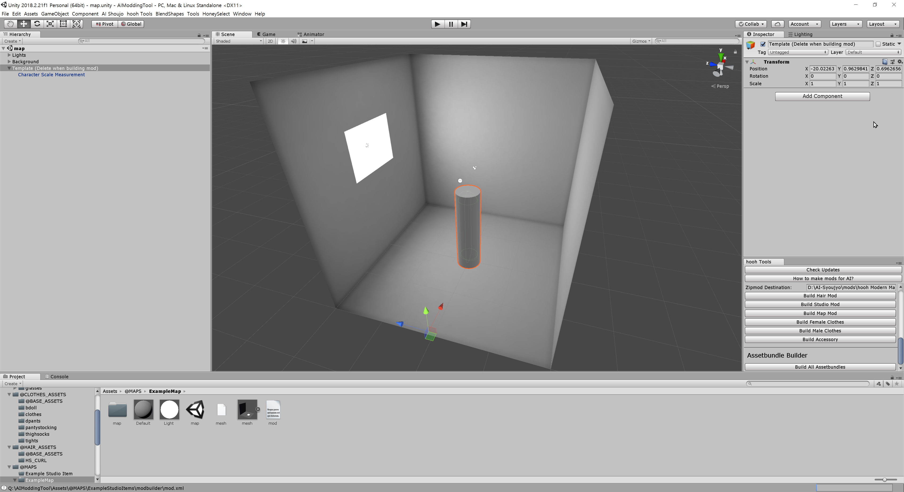

# Creating Custom Studio Map

[kind-introduction](../common/tutorial-introduction.md ':include')

-   [Getting Started with the hooh's Modding Tool](getting_started.md)
-   [Setting up Folder](tutorials/gearing-up.md)

## Steps

### Prepare Scene



Preparing the scene is a simple step. Just place the things as you want until it looks like a good map to enjoy with your characters.

### Add Scale to measure the map's size.

There is a `Character Scale Measurement` prefab that helps you scale your map into AI-shoujo's size. That cylinder is the average character size in AI-shoujo.

Most of the map will be fine if you scale 9x times larger than the original size. But I recommend you adjust the map scale with some visual reference like the doors or desks.

### (Optional) Place Lights

Since most people are not experts in lighting, it's good to put some lights and make scene static to make everyone look good.

You can bake lightmaps and reflection probe, light probes to get extra good quality.

### Make Everything in Layer 11 (Map)


Everything should be in Layer 11 to get properly lighted in-game. Otherwise, it will not get lit by any lights in the game.

### Save Scene


Save the scene to your mod folder. To avoid confusion, I recommend making a folder like `scenes` or `map00`.

But do not put multiple maps into one folder if the level has baked lightmaps. But you can put variants of the map that is using the same lightmap in the same folder.

### Creating Mod XML

```xml
<packer>
    <guid>example.studio.map</guid>
    <name>My First Studio Map</name>
    <version>1.0.0</version>
    <author>My Name</author>
    <description>My first outfit mod</description>
    <options>
         <!--
            If you're planning to release studio items with the map,
            I recommend you to put use-dependency on option for more
            perfomance and smaller size of zipmod.
          -->
          <use-dependency />
    </options>
    <bundles>
        <folder auto-path="maps" from="map00" filter=".*\.unity" target="map00" />
    </bundles>
    <build>
        <list type="map">
            <item name="My First Studio Map" scene="map_00" />
        </list>
    </build>
</packer>
```

[xml common tip](../common/xml-common.md ':include')

### Building the Mod

[building the mod](../common/building-mod.md ':include')

### Test In-Game

Test your map is working in the game. You can find your custom map in the map section.


[trouble shooting](../common/trouble-shooting.md ':include')

#### My map is weirdly placed in the game.

Place Root Object of Map `Position 0,0,0`, `Angle 0,0,0`, and `Scale 1,1,1` in `Transform` Component Inspector.

#### Map does not get lit by any lightings

Ensure that all of the game objects in `Layer 11 (Map)`. As I wrote in the Document, It will not get lit unless the objects are in the `Layer 11 (Map)`.
